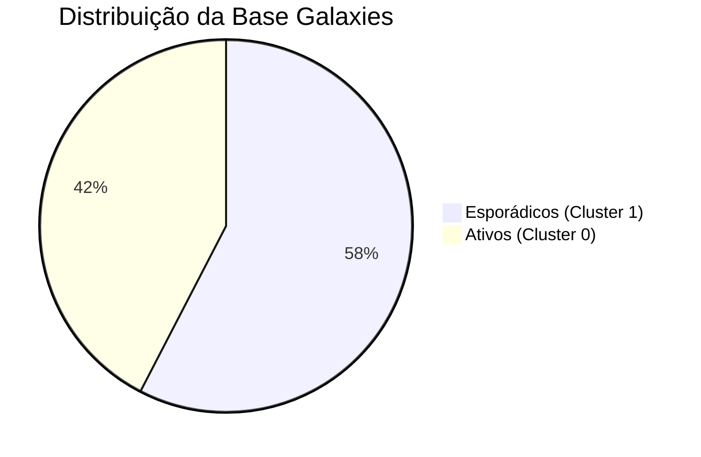

<!-- slide -->
# 🌌 Galaxies: Segmentando Clientes com Inteligência Artificial
### Do Dado Bruto às Personas Conversacionais
**Apresentação Executiva de Resultados e Insights**

---

<!-- slide -->
## 📋 O Desafio e a Solução Híbrida
* **O Problema**: A Galaxies precisava extrair valor de uma base de 3.000 consumidores para direcionar ações de marketing.
* **A Abordagem**: 
  1. **Data Science**: Análise e clustering estatístico (K-Means) para descobrir os perfis reais.
  2. **IA Generativa**: Criação de **Agentes Conversacionais** (Personas) para cada grupo.
* **O Resultado**: Os gestores agora podem **conversar diretamente** com os segmentos de clientes para validar ideias.

---

<!-- slide -->
## 📊 Estrutura Geral dos Clientes Galaxies
* **Total da Base**: 3.000 clientes analisados.
* **Variável Crítica de Separação**: **Frequência de Compra** (Mapeada via ANOVA: χ²=3000, p≈0).



---

<!-- slide -->
## 🎭 Segmento 0: O "Comprador Ativo"
> "Faço compras toda semana e busco conveniência no meu dia a dia."

### Perfil Estatístico (42.4% da base)
* **Ticket Médio**: R$ 122,07 | **Qtd. Itens**: ~4 itens por compra.
* **Idade Média**: 44 anos | **Gênero**: Predominantemente Masculino.
* **Canal Favorito**: Loja física (25%) | **Região**: Sudeste (24%).
* **Frequência**: Semanal (56.5% do grupo).
* **Meio de Pagamento**: Cartão de Crédito (22%).

---

<!-- slide -->
## 🎭 Segmento 1: O "Comprador Esporádico"
> "Compro de forma planejada a cada três meses, focando em estoque."

### Perfil Estatístico (57.6% da base)
* **Ticket Médio**: R$ 121,63 | **Qtd. Itens**: ~4 itens por compra.
* **Idade Média**: 45 anos | **Gênero**: Predominantemente Masculino.
* **Canal Favorito**: Loja física (23.8%) | **Região**: Sudeste (22.9%).
* **Frequência**: Trimestral (34.5% do grupo).
* **Meio de Pagamento**: Cartão de Crédito (24.3%).

---

<!-- slide -->
## 💬 Insight 1: Reação ao Aumento de 10% nos Preços
*Como cada segmento se comporta sob pressão inflacionária:*

| Segmento 0 (Ativo) | Segmento 1 (Esporádico) |
| :--- | :--- |
| **"Frustração Imediata"** | **"Preocupação e Planejamento"** |
| Foca no impacto do orçamento mensal recorrente. | Foca no impacto do ticket total por compra. |
| **Ação**: Reduz a quantidade comprada por visita e busca marcas alternativas. | **Ação**: Reduz a frequência geral de compras e estoca nas promoções físicas. |

---

<!-- slide -->
## 💬 Insight 2: Adoção de Novos Produtos
*A abertura para inovação e novos lançamentos:*

| Segmento 0 (Ativo) | Segmento 1 (Esporádico) |
| :--- | :--- |
| **"Inovação por Impulso"** | **"Adoção Cautelosa"** |
| Experimenta novas opções cerca de uma vez por mês. | Experimenta raramente (planejamento trimestral). |
| **Gatilho**: Destaque nas gôndolas e promoções de preço. | **Gatilho**: Indicação de amigos e produtos da categoria favorita (bebidas). |

---

<!-- slide -->
## 💬 Insight 3: Promoções Mais Atraentes
*A oferta ideal para maximizar a conversão:*

* **Para o Comprador Ativo (Segmento 0)**:
  * Promoções do tipo **"Leve 3, Pague 2"** em bebidas e snacks.
  * Programas de fidelidade com **pontuação acumulada** para troca futura.
* **Para o Comprador Esporádico (Segmento 1)**:
  * Descontos percentuais agressivos (ex: **20% Off** direto).
  * Incentivos digitais como **Frete Grátis** para elevar o volume do carrinho.

---

<!-- slide -->
## 🚀 Recomendações Estratégicas Galaxies

### 1. Marketing de Precisão
* **Ativos (0)**: Nutrição semanal com cupons recorrentes de reposição rápida.
* **Esporádicos (1)**: Campanhas de ativação pré-sazonal a cada 60/90 dias.

### 2. Sortimento de Produtos
* Criar pacotes (bundles) familiares e de alto volume para o Segmento 1 estocar.

### 3. Programa de Fidelidade
* Benefícios por recorrência (Fidelidade Ativa) direcionado ao Segmento 0.

---

<!-- slide -->
## 🔮 Próximo Passo: Futura Segmentação por Quadrantes RFM
* **O Diagnóstico**: Como `frequencia_compra` foi a única variável estatisticamente significativa nos clusters originais (K-Means), ela deve guiar o eixo principal.
* **A Oportunidade**: Combinar a frequência com o `ticket_medio` para criar 4 quadrantes altamente acionáveis:

```
                                     ticket alto
                                           │
    "Comprador Premium"   │  "Cliente VIP Fiel"
    (esporádico + caro)   │  (frequente + caro)
                          │
freq. baixa ──────────────┼───────────── freq. alta
                          │
    "Comprador Ocasional" │  "Cliente Popular"
    (esporádico + barato) │  (frequente + barato)
                          │
                                     ticket baixo
```

* **Por que evoluir para esse modelo?**
  * Cria **4 personas** com narrativas de negócio extremamente distintas.
  * Muito mais justificável comercialmente do que 2 clusters com tickets estatisticamente similares.
  * Permite ao sistema de agentes adotar 4 personalidades muito mais marcantes e precisas.
